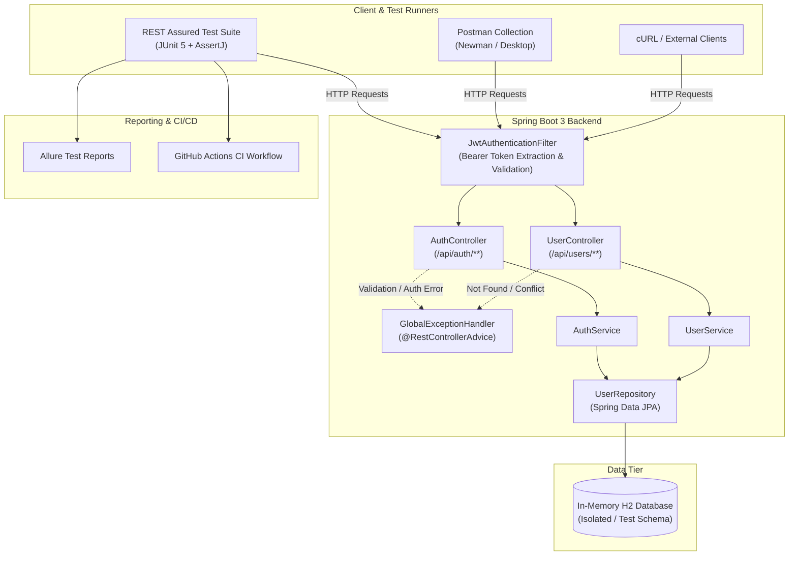

# QA Automation Project – Java REST API

[](https://www.oracle.com/java/)
[](https://spring.io/projects/spring-boot)
[](https://rest-assured.io/)
[](https://junit.org/junit5/)
[](https://qameta.io/allure-report/)
[]()

> A comprehensive QA Automation portfolio project showcasing practical API testing, automated regression suites, defect tracking, and modern test design patterns using **Java 21**, **Spring Boot 3**, **REST Assured**, **JUnit 5**, **AssertJ**, and **Postman**.

---

## 1. Project Overview

This repository demonstrates practical Quality Assurance Engineering principles for backend REST services. Rather than relying on mock tutorials or synthetic sandbox endpoints, this project implements:
1. A dedicated **User Management & Authentication REST API** with Bean Validation, JPA/Hibernate persistence, and stateless JWT Bearer token security.
2. A comprehensive **Automated API Testing Framework** written in Java utilizing **JUnit 5 Jupiter**, **REST Assured**, and **AssertJ**.
3. A formal **QA Defect Lifecycle** (`docs/BUG_REPORTS.md`) demonstrating real-world defect discovery, root cause analysis, automated regression testing, and verification.
4. An importable **Postman Collection & Environment** (`postman/`) with automated JavaScript pre-request and test assertion scripts.
5. Continuous Integration via **GitHub Actions** (`.github/workflows/tests.yml`) executing test suites on every pull request and push.

---

## 2. Architecture



### Architectural Highlights
- **Stateless Authentication**: JSON Web Tokens (HMAC-SHA256) protect sensitive user endpoints while permitting public registration and login flows.
- **Dynamic Port Isolation**: REST Assured tests automatically bind to random ports allocated by `@SpringBootTest(webEnvironment = RANDOM_PORT)`, avoiding port conflicts in local or CI environments.
- **Decoupled Test Data**: Test execution is fully idempotent. The `TestDataGenerator` builds randomized emails, usernames, and boundary payloads per test to eliminate flaky test collisions.
- **Standardized Error Contract**: Every error (400, 401, 404, 409) returns a uniform JSON payload (`ErrorResponse`) with timestamps, HTTP status, and field-level validation breakdowns.

---

## 3. Technology Stack

| Layer | Technology | Version | Purpose |
| :--- | :--- | :--- | :--- |
| **Backend Framework** | Spring Boot | 3.3.4 | REST API service container |
| **Language** | Java | 21 LTS | Backend and QA test automation language |
| **Security** | Spring Security & JJWT | 6.x / 0.12.5 | Stateless JWT authentication & authorization |
| **Persistence** | Spring Data JPA / Hibernate | 6.x | Relational entity mapping & query execution |
| **Database** | H2 Database | Runtime | In-memory relational storage for testing & prototyping |
| **Testing Framework**| JUnit 5 (Jupiter) | 5.10.x | Test orchestration, lifecycle, and tagging |
| **API Client** | REST Assured | 5.4.0 | Fluent HTTP request dispatch & assertion engine |
| **Assertions** | AssertJ & Hamcrest | 3.25.x | Fluent, expressive, self-describing assertions |
| **Reporting** | Allure Report | 2.27.0 | Visual execution dashboards & step attachments |
| **Manual Testing** | Postman | v2.1.0 format | Pre-configured collection with embedded JS tests |
| **Build & CI** | Maven & GitHub Actions | 3.9.x / v4 | Build automation and Continuous Integration pipeline |

---

## 4. API Endpoints

| Method | Endpoint | Access | Status Codes | Description |
| :--- | :--- | :--- | :--- | :--- |
| `POST` | `/api/auth/register` | Public | `201`, `400`, `409` | Register a new user account |
| `POST` | `/api/auth/login` | Public | `200`, `400`, `401` | Authenticate user and issue JWT token |
| `GET` | `/api/users` | Bearer Token | `200`, `401` | Retrieve list of all users (optional `?search=` filter) |
| `GET` | `/api/users/{id}` | Bearer Token | `200`, `400`, `401`, `404` | Retrieve single user record by ID |
| `POST` | `/api/users` | Bearer Token | `201`, `400`, `401`, `409` | Administratively create a new user |
| `PUT` | `/api/users/{id}` | Bearer Token | `200`, `400`, `401`, `404`, `409` | Update existing user details |
| `DELETE` | `/api/users/{id}` | Bearer Token | `204`, `401`, `404` | Permanently delete user by ID |

---

## 5. Testing Strategy

The QA strategy enforces the test automation pyramid with focus on API reliability:
- **Component Isolation**: In-memory database with clean schema creation on each test session.
- **Specification Reusability**: Common headers, logging filters, and authentication tokens are encapsulated in `RequestSpecs` and `AuthTokenManager`.
- **Negative Testing by Design**: Over 60% of test scenarios explicitly validate boundary failures, security rejections, and malformed inputs.
- **Regression Traceability**: Every identified defect is mapped to a specific automated regression test case.

---

## 6. Automated Test Coverage

The test suite contains **48 automated test cases** categorized across 6 primary test suites:

| Test Suite Class | Package | Tests Run | Focus Area |
| :--- | :--- | :--- | :--- |
| `AuthRegistrationTests` | `com.portfolio.qa.tests.auth` | 8 | Valid registration, format checks, duplicate email, case sensitivity |
| `AuthLoginTests` | `com.portfolio.qa.tests.auth` | 7 | Valid credentials, bad passwords, unregistered users, token format |
| `UserCreationTests` | `com.portfolio.qa.tests.users` | 5 | Admin user creation, duplicate prevention, missing fields |
| `UserRetrievalTests` | `com.portfolio.qa.tests.users` | 7 | List users, ID lookup, keyword search, 404 handling, password hiding |
| `UserUpdateTests` | `com.portfolio.qa.tests.users` | 5 | Update profile, retaining own email, duplicate collisions, 404 handling |
| `UserDeletionTests` | `com.portfolio.qa.tests.users` | 4 | Delete user, 204 status, post-deletion 404 verification |
| `AuthenticationSecurityTests` | `com.portfolio.qa.tests.security` | 5 | Unauthenticated access, malformed tokens, tampered signatures |
| `InputValidationEdgeCasesTests` | `com.portfolio.qa.tests.edgecases` | 7 | Min/max lengths, malformed JSON, empty bodies, XSS/special characters |

---

## 7. Positive Tests
- **Valid Registration**: Asserts `201 Created`, valid user ID generation, normalized email, default `USER` role, and timestamp presence.
- **Valid Login**: Asserts `200 OK`, JWT token format (`Bearer`), expiry window, and matching user profile.
- **Valid User Creation**: Asserts `201 Created` with authenticated Bearer header.
- **User Retrieval & Querying**: Verifies `200 OK` on `/api/users` and `/api/users/{id}`, testing search filtering by username.
- **User Modification**: Updates username and email via `PUT /api/users/{id}` and verifies state changes.
- **User Deletion**: Asserts `204 No Content` and subsequent resource absence.

---

## 8. Negative Tests
- **Invalid Email Syntax**: Rejects `not-an-email`, `user@.com`, and blank strings with `400 Bad Request`.
- **Short & Empty Passwords**: Rejects passwords below 8 characters with explicit validation message.
- **Duplicate Email Rejection**: Rejects already registered email addresses with `409 Conflict`.
- **Non-Existent Resource Operations**:
  - `GET /api/users/999999` returns `404 Not Found`.
  - `PUT /api/users/888888` returns `404 Not Found`.
  - `DELETE /api/users/777777` returns `404 Not Found`.
- **Bad Parameter Types**: Passing `invalid-id-string` to `/api/users/{id}` returns `400 Bad Request` with type mismatch details.
- **Unauthorized Requests**: Calling any `/api/users/**` route without token returns `401 Unauthorized`.

---

## 9. Edge Cases
- **Maximum Length Boundaries**: Username over 50 characters and email over 100 characters return `400 Bad Request`.
- **Minimum Length Boundaries**: 2-character username (below 3) returns `400 Bad Request`.
- **Whitespace Injection**: Whitespace-only username (`"    "`) and whitespace-only email are rejected.
- **Malformed JSON Bodies**: Unclosed braces or malformed JSON payloads return clean `400 Bad Request` with descriptive error messages.
- **Special Characters & XSS Protection**: Usernames containing `<script>` or forbidden symbols are rejected by validation regex (`^[a-zA-Z0-9_.-]+$`).

---

## 10. Bug Reporting

A core element of this project is demonstrating the complete **QA Lifecycle**:

$$\text{Automated Test} \longrightarrow \text{Defect Discovered} \longrightarrow \text{Documented} \longrightarrow \text{Fixed} \longrightarrow \text{Regression Verified}$$

All bugs are formally documented in [`docs/BUG_REPORTS.md`](file:///c:/Users/ASUS%20TUF/Documents/antigravity/calm-chandrasekhar/docs/BUG_REPORTS.md):

1. **BUG-001**: Duplicate email accepted when character case differed (`user@test.com` vs `USER@TEST.COM`). Fixed via case-insensitive check and lowercase normalization. Regression test: `TC-AUTH-007`.
2. **BUG-002**: User update endpoint threw false `409 Conflict` when user retained their own email. Fixed via `existsByEmailIgnoreCaseAndIdNot()`. Regression test: `TC-USER-011`.
3. **BUG-003**: Deleting non-existent user returned success instead of `404 Not Found`. Fixed by verifying existence prior to deletion. Regression test: `TC-USER-014`.
4. **BUG-004**: Whitespace-only username strings were accepted during registration. Fixed via `@NotBlank` and regex pattern validation. Regression test: `TC-AUTH-008`.
5. **BUG-005**: Missing authentication header triggered empty 403 instead of standard 401 JSON. Fixed via `JwtAuthenticationEntryPoint`. Regression test: `TC-SEC-001`.

---

## 11. Postman

A fully functional Postman collection and environment are provided in the [`postman/`](file:///c:/Users/ASUS%20TUF/Documents/antigravity/calm-chandrasekhar/postman/) directory:
- **Collection**: [`postman/User-Management-API.postman_collection.json`](file:///c:/Users/ASUS%20TUF/Documents/antigravity/calm-chandrasekhar/postman/User-Management-API.postman_collection.json)
- **Environment**: [`postman/Local-Environment.postman_environment.json`](file:///c:/Users/ASUS%20TUF/Documents/antigravity/calm-chandrasekhar/postman/Local-Environment.postman_environment.json)

### Importing and Running:
1. Open Postman &rarr; Click **Import** &rarr; Select both JSON files from `postman/`.
2. Select the **Local-Environment** in the top-right environment selector.
3. Start the application backend:
   ```bash
   mvn spring-boot:run
   ```
4. Run the requests sequentially, or use **Postman Collection Runner** to execute the entire suite automatically.

---

## 12. Test Reports

### Allure Reporting Integration
Allure Report is integrated directly via `allure-junit5` and `allure-rest-assured`.

To generate and view the interactive HTML report:
```bash
# Execute tests to generate allure-results
mvn clean test

# Generate and launch local Allure report server
mvn allure:serve
```

Or generate a static HTML report:
```bash
mvn allure:report
```
The report will be available in `target/site/allure-maven-plugin/index.html`.

### Surefire Standard Reports
Standard XML and text test reports are generated on every run in:
`target/surefire-reports/`

---

## 13. CI/CD

Continuous Integration is implemented via **GitHub Actions** in [`.github/workflows/tests.yml`](file:///c:/Users/ASUS%20TUF/Documents/antigravity/calm-chandrasekhar/.github/workflows/tests.yml).

The pipeline:
1. Checks out repository code.
2. Configures Eclipse Temurin JDK 21 with Maven caching.
3. Builds and compiles the application.
4. Executes all 48 automated tests (`mvn test`).
5. Archives and uploads Surefire and Allure test reports as workflow artifacts.
6. Blocks merge if any test fails.

---

## 14. Project Structure

```
qa-java-api-project/
│
├── .github/
│   └── workflows/
│       └── tests.yml                     # GitHub Actions CI workflow
│
├── docs/
│   ├── TEST_PLAN.md                      # Formal QA Test Strategy & Plan
│   ├── TEST_CASES.md                     # Comprehensive Test Case Matrix & Specs
│   └── BUG_REPORTS.md                    # Defect Logs & QA Lifecycle Documentation
│
├── postman/
│   ├── User-Management-API.postman_collection.json   # Postman API Collection
│   └── Local-Environment.postman_environment.json    # Postman Environment Variables
│
├── src/
│   ├── main/
│   │   ├── java/com/portfolio/qa/
│   │   │   ├── config/                   # Seed Data Initializer
│   │   │   ├── controller/               # REST Controllers (Auth & Users)
│   │   │   ├── dto/                      # Request/Response/Error Data Transfer Objects
│   │   │   ├── entity/                   # JPA Entities (User, Role)
│   │   │   ├── exception/                # Global Exception Handler & Custom Errors
│   │   │   ├── repository/               # Spring Data JPA Repositories
│   │   │   ├── security/                 # JWT Provider, Auth Filters & SecurityConfig
│   │   │   ├── service/                  # Business Logic (AuthService, UserService)
│   │   │   └── UserManagementApplication.java
│   │   └── resources/
│   │       └── application.yml           # Application configuration
│   │
│   └── test/
│       ├── java/com/portfolio/qa/
│       │   ├── config/                   # BaseTest & TestConfig
│       │   ├── testdata/                 # TestDataGenerator & UserTestData Factory
│       │   ├── utils/                    # AuthTokenManager & RequestSpecs
│       │   └── tests/
│       │       ├── auth/
│       │       │   ├── AuthRegistrationTests.java
│       │       │   └── AuthLoginTests.java
│       │       ├── users/
│       │       │   ├── UserCreationTests.java
│       │       │   ├── UserRetrievalTests.java
│       │       │   ├── UserUpdateTests.java
│       │       │   └── UserDeletionTests.java
│       │       ├── security/
│       │       │   └── AuthenticationSecurityTests.java
│       │       └── edgecases/
│       │           └── InputValidationEdgeCasesTests.java
│       └── resources/
│           └── application-test.yml      # Isolated test profile configuration
│
├── pom.xml                               # Maven project configuration
├── README.md                             # Project documentation
└── .gitignore
```

---

## 15. How to Run the Backend

### Prerequisites
- **Java 21** or higher (`java -version`)
- **Maven 3.8+** (or use the included `.\mvn.cmd` / `./mvnw`)

### Start the Application
```bash
# Clone the repository
git clone https://github.com/iamyoussef2005/qa-java-api.git
cd qa-java-api

# Start the Spring Boot server
mvn spring-boot:run
```
The server will start at `http://localhost:8080`.

Default seeded credentials:
- **Admin**: `admin@example.com` / `AdminPass123!`
- **User**: `testuser@example.com` / `UserPass123!`
- **H2 Console**: `http://localhost:8080/h2-console` (JDBC URL: `jdbc:h2:mem:userdb`, User: `sa`, Password: *empty*)

---

## 16. How to Run Tests

### Run All Tests
```bash
mvn clean test
```

### Run a Specific Test Class
```bash
mvn test -Dtest=AuthRegistrationTests
```

### Run Tests by Tag (e.g. Smoke or Security)
```bash
mvn test -Dgroups="smoke"
mvn test -Dgroups="security"
mvn test -Dgroups="regression"
```

### Run Against an External / Deployed Server
```bash
mvn test -Dapi.base.url=http://my-staging-server:8080
```

---

## 17. Example Test Results

Execution output from `mvn test`:

```
[INFO] -------------------------------------------------------
[INFO]  T E S T S
[INFO] -------------------------------------------------------
[INFO] Running com.portfolio.qa.tests.auth.AuthLoginTests
[INFO] Tests run: 7, Failures: 0, Errors: 0, Skipped: 0, Time elapsed: 15.03 s -- in com.portfolio.qa.tests.auth.AuthLoginTests
[INFO] Running com.portfolio.qa.tests.auth.AuthRegistrationTests
[INFO] Tests run: 8, Failures: 0, Errors: 0, Skipped: 0, Time elapsed: 0.98 s -- in com.portfolio.qa.tests.auth.AuthRegistrationTests
[INFO] Running com.portfolio.qa.tests.security.AuthenticationSecurityTests
[INFO] Tests run: 5, Failures: 0, Errors: 0, Skipped: 0, Time elapsed: 0.34 s -- in com.portfolio.qa.tests.security.AuthenticationSecurityTests
[INFO] Running com.portfolio.qa.tests.users.UserCreationTests
[INFO] Tests run: 5, Failures: 0, Errors: 0, Skipped: 0, Time elapsed: 0.77 s -- in com.portfolio.qa.tests.users.UserCreationTests
[INFO] Running com.portfolio.qa.tests.users.UserDeletionTests
[INFO] Tests run: 4, Failures: 0, Errors: 0, Skipped: 0, Time elapsed: 1.05 s -- in com.portfolio.qa.tests.users.UserDeletionTests
[INFO] Running com.portfolio.qa.tests.users.UserRetrievalTests
[INFO] Tests run: 7, Failures: 0, Errors: 0, Skipped: 0, Time elapsed: 0.74 s -- in com.portfolio.qa.tests.users.UserRetrievalTests
[INFO] Running com.portfolio.qa.tests.users.UserUpdateTests
[INFO] Tests run: 5, Failures: 0, Errors: 0, Skipped: 0, Time elapsed: 0.89 s -- in com.portfolio.qa.tests.users.UserUpdateTests
[INFO] Running com.portfolio.qa.tests.edgecases.InputValidationEdgeCasesTests
[INFO] Tests run: 7, Failures: 0, Errors: 0, Skipped: 0, Time elapsed: 0.65 s -- in com.portfolio.qa.tests.edgecases.InputValidationEdgeCasesTests
[INFO] 
[INFO] Results:
[INFO] 
[INFO] Tests run: 48, Failures: 0, Errors: 0, Skipped: 0
[INFO] 
[INFO] ------------------------------------------------------------------------
[INFO] BUILD SUCCESS
[INFO] ------------------------------------------------------------------------
```

---

## 18. Skills Demonstrated

This portfolio project provides tangible proof of practical QA Automation and software engineering competencies:

- **Core Java & Modern OOP**: Clean architecture, builder patterns, encapsulation, stream operations, and exception modeling.
- **Automated API Testing**: Deep proficiency with **REST Assured**, request specifications, header configuration, and response validation.
- **Test Framework Design**: Clean separation of test layers (`config`, `testdata`, `utils`, `tests`), preventing flaky tests through dynamic data generation.
- **REST & HTTP Protocols**: Verification of semantic HTTP status codes (`200`, `201`, `204`, `400`, `401`, `404`, `409`), request methods, and headers.
- **Security & JWT Verification**: Automated testing of token validation, authentication failures, tampered signatures, and authorization gates.
- **Defect Lifecycle Management**: Documenting reproducible bug reports with steps, severity, priority, expected vs actual behavior, and regression test implementation.
- **CI/CD Automation**: GitHub Actions workflow automation, automated reporting, and build pipeline health checks.
- **Reporting & Observability**: Visual dashboards with Allure Report and JUnit Surefire reports.
